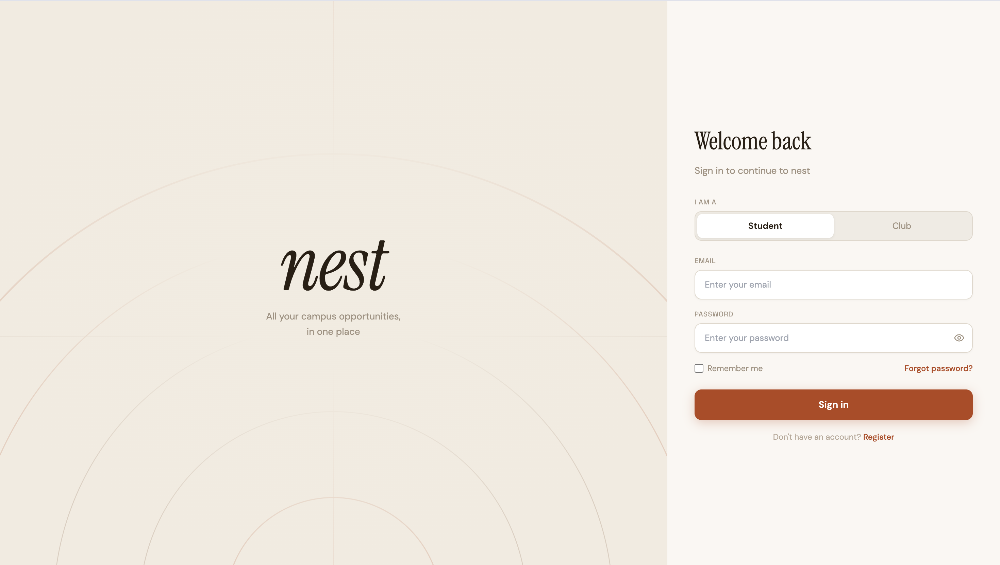
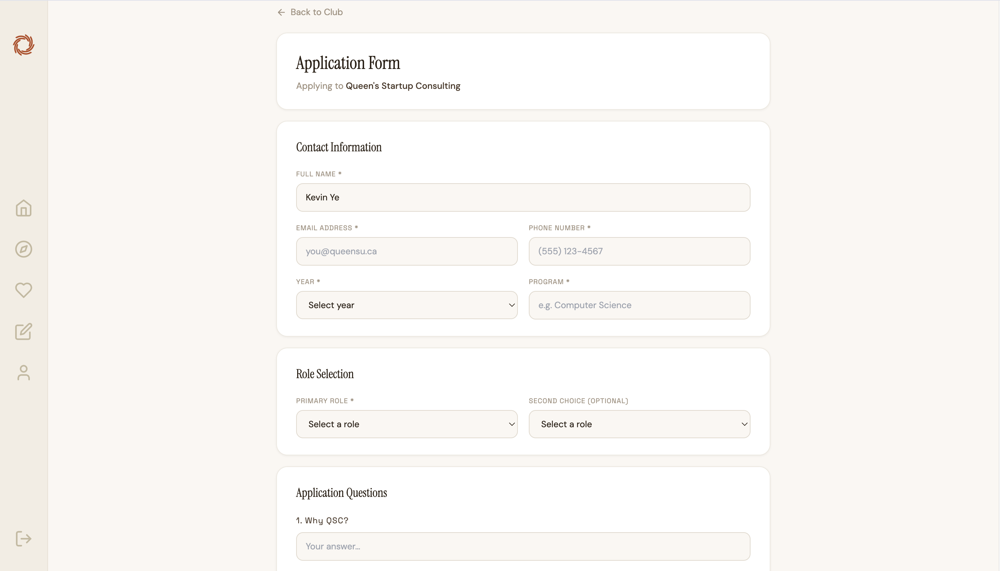

# Nest

A club discovery and recruitment platform for university students. Students can browse clubs, save favourites, submit applications, and track hiring timelines. Clubs manage their profile, review applicants, and update application statuses — all from a dedicated club-facing interface.

---

## Features

### Student side
- Browse and search clubs by category, recruiting status, and keyword
- Save clubs to a favourites list
- Submit applications with custom question responses and file uploads (PDF)
- Track application status
- View upcoming deadlines and interview dates on the hiring dashboard
- Leave ratings and written reviews for clubs

### Club side
- Set up and edit a public club profile (logo, backdrop, description, categories, social links, open positions, hiring timeline)
- Build a custom application form with short answer, long answer, and file upload questions
- View and manage incoming applications with status controls
- Analytics dashboard with application trends over time

---

## Gallery

### Login


### Student discovery


### Club info


### Application


### Student application tracker


### Club dashboard


### Club application review form


---

## Tech stack

| Layer | Technology |
|---|---|
| Languages | JavaScript, SQL |
| Frontend | React 18, React Router v6, Recharts, Lucide React |
| Backend | Node.js, Supabase (Postgres, Auth, Storage, RLS) |

---

## Getting started

### Prerequisites
- Node.js 18+
- A [Supabase](https://supabase.com) project

### 1. Clone and install

```bash
git clone <repo-url>
cd Nest-2
npm install
cd client && npm install
```

### 2. Set up Supabase

1. Create a new Supabase project
2. Run `supabase/schema.sql` in the **SQL Editor** to create all tables, policies, and triggers
3. In **Storage**, create three public buckets: `club-assets`, `avatars`, `application-files`
4. Add storage RLS policies for each bucket (allow authenticated users to insert and select)

### 3. Configure environment

Create `client/.env.local`:

```
REACT_APP_SUPABASE_URL=https://your-project.supabase.co
REACT_APP_SUPABASE_ANON_KEY=your-anon-key
DANGEROUSLY_DISABLE_HOST_CHECK=true
```

